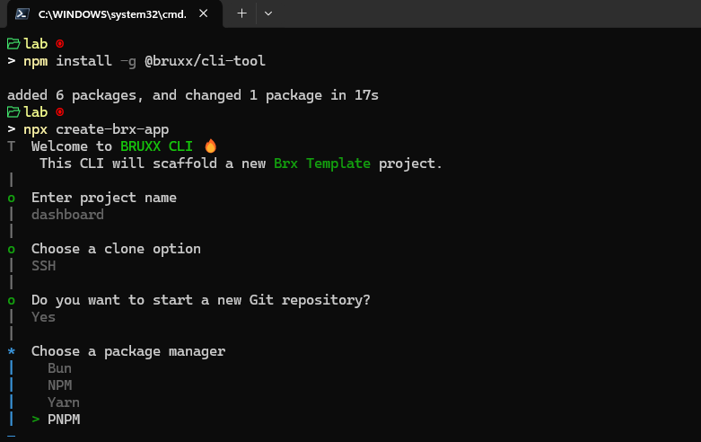

# BRX TEMPLATE - Boilerplate for Modern Development 🚀

## Introduction

`BRX TEMPLATE` is a boilerplate designed to accelerate the setup of a modern React project. The idea for this template came from the fact that there wasn’t an existing boilerplate that included a fully configured and optimized environment for fast and efficient development.

Every time I started a new project, I would spend hours, sometimes even days, just setting up the environment before writing a single line of code. Additionally, deploying with Docker and setting up CI/CD took a considerable amount of time.

That’s why I decided to create **BRX TEMPLATE**, a ready-to-use solution with best practices already integrated, allowing you to focus on what really matters: **developing your application**.

## 🚀 Why Choose BRX TEMPLATE?

- **Save time**: No more repetitive setup for every project.
- **Modern and efficient**: Uses the best tools for a smooth development experience.
- **Cloud-ready**: Built-in Docker configuration for simplified deployment.
- **Quality and maintainability**: Linting, formatting, and commit conventions ensure clean code.
- **Scalability**: Designed for modern and scalable applications.

## 📦 Tools and Technologies

BRX TEMPLATE uses a combination of the best tools for modern and scalable development:

### Development

- **Vite**: Fast and modern build tool.
- **React**: JavaScript library for building user interfaces.
- **TypeScript**: Adds static types to JavaScript.
- **Zod**: TypeScript schema validation.
- **Zustand**: Lightweight and simple state management.
- **TanStack Router**: Modern and type-safe routing.
- **TanStack Query**: Client-side data management.

### Testing

- **Vitest**: Testing framework for unit and component tests.

### Styling

- **TailwindCSS**: Utility-first CSS framework.
- **PostCSS**: CSS transformation with JavaScript.

### Code Quality

- **ESLint**: Linting for JavaScript/TypeScript.
- **Prettier**: Code formatting.

### Deployment

- **Docker**: Application containerization.
- **GitHub Actions**: Continuous Integration and Continuous Deployment (CI/CD).

### Other

- **Commitlint**: Commit message validation.
- **Husky**: Git hooks to automate tasks.
- **T3-env**: Environment variable management.

## 📂 Project Structure

The following is the folder structure of the BRX TEMPLATE boilerplate:

```
project-name/
│── .github/              # GitHub configuration (Workflows, Actions)
│── .husky/               # Git hooks (Commitlint, Pre-push checks)
│── coverage/             # Code coverage reports
│── dist/                 # Build output directory
│── node_modules/         # Dependencies
│── public/               # Static assets (favicon, images, etc.)
│── src/                  # Application source code
│   ├── __tests__/        # Unit and component tests
│   ├── assets/           # Static assets like images, fonts
│   ├── components/       # Reusable UI components
│   ├── lib/              # Library functions and helpers
│   ├── routes/           # Application routes
│   ├── store/            # Zustand store
│   ├── types/            # TypeScript types
│   ├── app.tsx          # Main application component
│   ├── env.ts           # Environment configuration
│   ├── index.css        # Global styles
│   ├── main.tsx         # Entry point
│   ├── providers.tsx    # Context providers
│   ├── router.tsx       # Router configuration
│   ├── routeTree.gen.ts # Generated route tree
│   ├── vite-env.d.ts    # Vite environment types
│── .env                 # Environment variables
│── .env.example         # Example environment variables
│── .gitignore           # Git ignored files
│── .lintstagedrc.json   # Lint-staged configuration
│── .nvmrc               # Node version configuration
│── .prettierrc          # Prettier configuration
│── commitlint.config.cjs # Commitlint configuration
│── debug.log            # Debug logs
│── docker-compose.yml   # Docker Compose configuration
│── Dockerfile           # Docker configuration
│── eslint.config.js     # ESLint configuration
│── index.html           # Main HTML file
│── package.json         # Dependencies and scripts
│── pnpm-lock.yaml       # Lockfile for dependencies
│── postcss.config.ts    # PostCSS configuration
```



## ⚡ Installation & Getting Started

1. **Install the CLI globally**

   ```sh
   npm install -g @bruxx/cli-tool
   ```

2. **Create a new BRX project**

   ```sh
   npx create-brx-app
   ```

3. **Run the project locally**
   ```sh
   [package manager] dev or run dev
   ```
4. **Build the project**
   ```sh
   [package manager] build or run build
   ```

## 🚀 Deployment with Docker

To deploy the application in a Docker container:

1. **Build the container**

   ```sh
   docker build . -t "<container-name>"
   ```

2. **Start the container**

   ```sh
    docker-compose up -d
   ```

3. **Stop the container**
   ```sh
    docker-compose down
   ```

---

## 🤝 Contributing

We welcome contributions! If you’d like to contribute to `BRX TEMPLATE`, please submit a pull request or open an issue.
